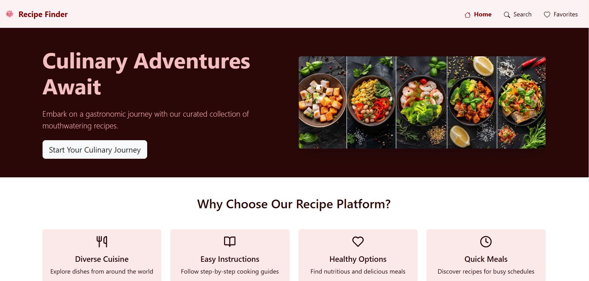
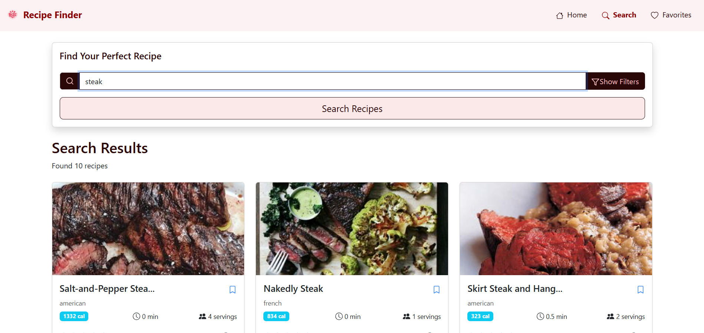
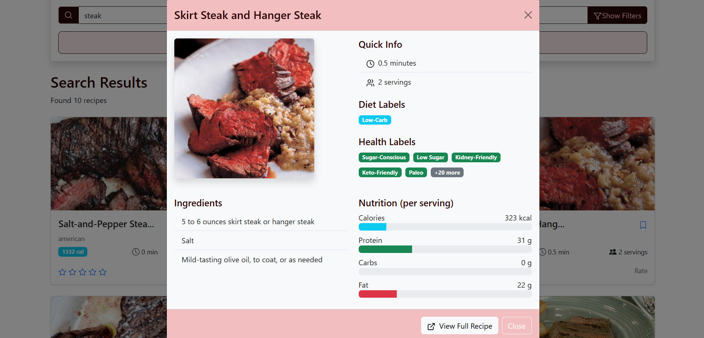
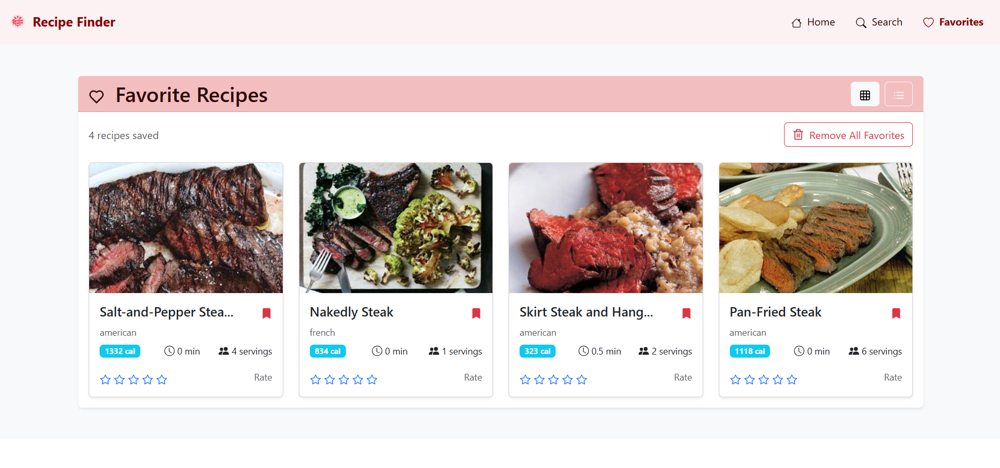
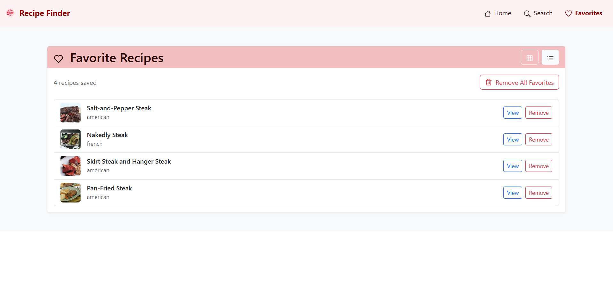

# Recipe Finder

## Overview
Recipe Finder is a web application designed to help users discover and save their favorite recipes. The app allows users to search for recipes based on ingredients or dish names, view recipe details, and save their favorite recipes for easy access.

## Features
- **User-Friendly Interface**: Intuitive navigation and layout for an enhanced user experience.
- **Search Functionality**: Easily search for recipes using keywords or ingredients.
- **Recipe Details**: View detailed information about each recipe, including ingredients and preparation steps.
- **Favorites List**: Save your favorite recipes for quick access later.
- **Responsive Design**: Optimized for both desktop and mobile devices.

## Technologies Used
- **Frontend**: React.js
- **Styling**: Bootstrap for responsive design and layout.
- **Icons**: React Bootstrap Icons and Lucide React.
- **APIs**: Integrates with a recipe API to fetch recipe data.
- **Routing**: React Router for navigation between pages.


## Screenshots
Here are some screenshots of the Recipe Finder application:

### Home Page


### Search Page


### Recipe Details


### Favorites List



## Getting Started

### Prerequisites
Make sure you have the following installed:
- Node.js (v12 or later)
- npm or yarn

### Installation
1. Clone the repository:
   ```bash
   git clone https://github.com/yourusername/recipe-finder.git
   ```
2. Navigate into the project directory:
   ```bash
   cd recipe-finder
   ```
3. Install dependencies:
   ```bash
   npm install
   # or
   yarn install
   ```

### Running the Application
To start the development server, run:
```bash
npm start
# or
yarn start
```
This will open the application in your default web browser at `http://localhost:3000`.

## Usage
- Navigate through the app using the navbar.
- Use the search feature to find recipes.
- Click on any recipe to view its details.
- Save your favorite recipes for future reference.

## Contributing
Contributions are welcome! If you'd like to contribute, please fork the repository and create a pull request with your changes.

## License
This project is licensed under the MIT License - see the [LICENSE](LICENSE) file for details.

## Acknowledgments
- [React](https://reactjs.org/) - A JavaScript library for building user interfaces.
- [Bootstrap](https://getbootstrap.com/) - A front-end framework for developing responsive websites.
- [Recipe API](https://developer.edamam.com/edamam-recipe-api) - EDAMAM Recipe API used for fetching recipes.

